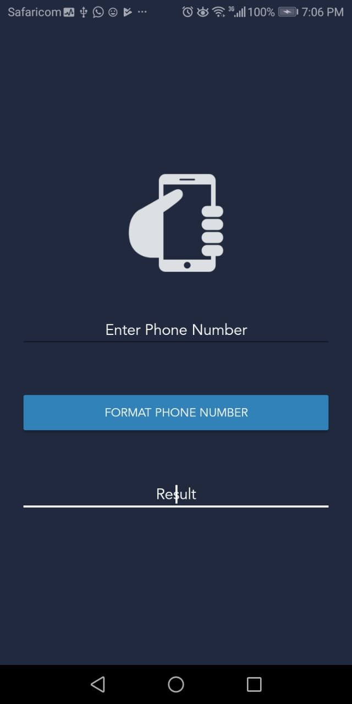
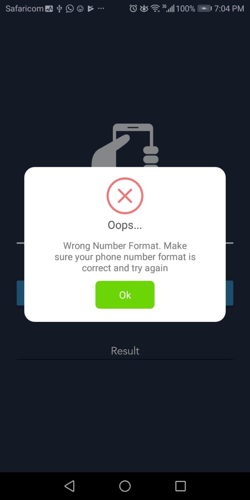
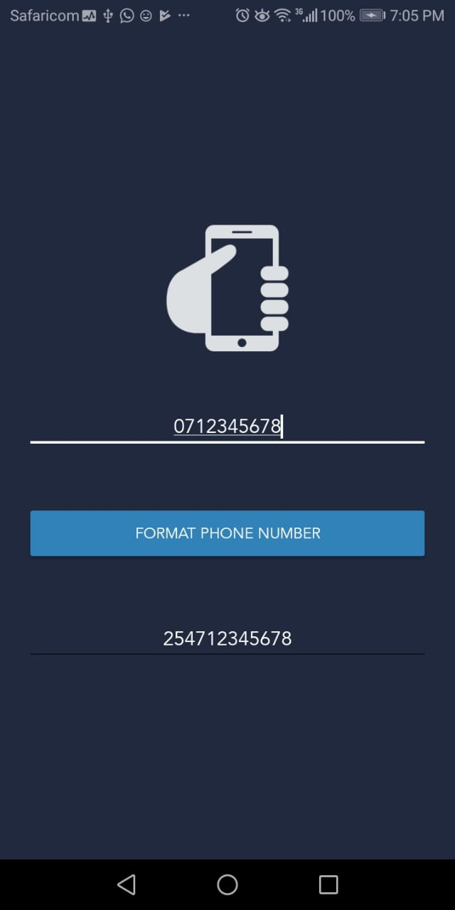

# Phone Number Formatter

[](https://jitpack.io/#Ikami-Mercy/phone-number-formatter)


An android library to format Kenya 🇰🇪 Phone Number to international format.

### Download
You can add the library to your project via gradle

```
Step 1: Add in your root build.gradle of your project
   allprojects {
       repositories {
           ...
           maven { url 'https://jitpack.io' }
       }
   }

Step 2: Add the dependency to your app gradle
   dependencies {
       ...
    implementation 'com.github.Ikami-Mercy:phone-number-formatter:{latest-version}'
    ...
   }
```

### Usage
To use the library call it from your Fragment or activity.

```kotlin
    // Kotlin example

    // Initialize your phone number
    val phoneNumber = "0712345678"

    // Check if your phone number is valid
    val valid = PhoneNumberFormatter.isValidPhoneNumber(phoneNumber)

    // Format your phone number
   val formattedNumber =PhoneNumberFormatter.formatPhoneNumber(phoneNumber)
```

```java
    // Java example

    // Initialize your phone number
    String phoneNumber = "0712345678"

    // Check if your phone number is valid
    Boolean valid = PhoneNumberFormatter.isValidPhoneNumber(phoneNumber)

    // Format your phone number
   String formattedNumber =PhoneNumberFormatter.formatPhoneNumber(phoneNumber)
```


### Screenshots
  


### License
```
MIT License

Copyright (c) 2019 Mercy Ikami

Permission is hereby granted, free of charge, to any person obtaining a copy
of this software and associated documentation files (the "Software"), to deal
in the Software without restriction, including without limitation the rights
to use, copy, modify, merge, publish, distribute, sublicense, and/or sell
copies of the Software, and to permit persons to whom the Software is
furnished to do so, subject to the following conditions:
The above copyright notice and this permission notice shall be included in all
copies or substantial portions of the Software.
THE SOFTWARE IS PROVIDED "AS IS", WITHOUT WARRANTY OF ANY KIND, EXPRESS OR
IMPLIED, INCLUDING BUT NOT LIMITED TO THE WARRANTIES OF MERCHANTABILITY,
FITNESS FOR A PARTICULAR PURPOSE AND NONINFRINGEMENT. IN NO EVENT SHALL THE
AUTHORS OR COPYRIGHT HOLDERS BE LIABLE FOR ANY CLAIM, DAMAGES OR OTHER
LIABILITY, WHETHER IN AN ACTION OF CONTRACT, TORT OR OTHERWISE, ARISING FROM,
OUT OF OR IN CONNECTION WITH THE SOFTWARE OR THE USE OR OTHER DEALINGS IN THE
SOFTWARE.
```